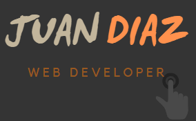

<!--
[![Contributors][contributors-shield]][contributors-url]
[![Forks][forks-shield]][forks-url]
[![Stargazers][stars-shield]][stars-url]
[![Issues][issues-shield]][issues-url]
[![MIT License][license-shield]][license-url]
[![LinkedIn][linkedin-shield]][linkedin-url]
-->

<!-- PROJECT LOGO -->

  

  <h2 align="center">Hello 👋</h2>
  

My name is . I am originally from Colombia, but recently moved to Asheville, NC. :us: I have completed an A.A.S in Web Technologies at Central Piedmont Community College in Charlotte, NC. I enjoy developing new skills in both front and back-end development and I am passionate about Full stack Web Development. Currently, I have a few years of experience as a Service Desk Analyst. However, I am looking forward to working with a Startup company that allows for professional and personal growth.  I value discipline, loyalty, reliability, and self-motivation above all else.

  <h3>Skills</h3>
  <ul>
    
✔️ Problem solving skills

    
✔️ Critical thinking

    
✔️ Time Management

    
✔️ Disciplined

    
✔️ Detail-oriented

    
✔️ Customer Service

    
:heavy_check_mark: Adaptability

    
:heavy_check_mark: Bilingual

  </ul>

  
<h3>Current Job Description 💰</h3>

  <ul>
    <li>Handles technical troubleshooting within an enterprise environment. Navigates common issues such as user administration, network outages, network printers, IP phones and enterprise tools.</li>
  <li>Provides remote assistance with software deployment, and system configuration.</li>
  <li>Effectively communicate with a variety of departments.</li>
  <li>Proactively investigate and resolve end user problems/complications. </li>
  <li>Adaptability to multiple enterprise environments.Following a process oriented approach. </li>
  <li>Utilizes problem solving skills to find solutions to unusual issues. </li>
  </ul>

## Current Job Description 💰

<ul>
  <li>Handles technical troubleshooting within an enterprise environment. Navigates common issues such as user administration, network outages, network printers, IP phones and enterprise tools.</li>
  <li>Provides remote assistance with software deployment, and system configuration.</li>
  <li>Effectively communicate with a variety of departments.</li>
  <li>Proactively investigate and resolve end user problems/complications. </li>
  <li>Adaptability to multiple enterprise environments.Following a process oriented approach. </li>
  <li>Utilizes problem solving skills to find solutions to unusual issues. </li>
</ul>

<!-- TABLE OF CONTENTS -->

  
<b>Table of Contents</b>

  
<a href="#recentProjects">Projects</a>

    <ul>
      
📌<a href="#most-recent-projects">Most Recent Projects</a>

      <ul>📌<a href="#home-server">Home Server</a></ul>
      
📌<a href="#platzi-portfolio">Platzi Portfolio</a>

      
📌<a href="#school-portfolio">School Portfolio</a>

      
📌<a href="#web-page">Web Page</a>

      
📌<a href="#others">Others</a>

    </ul>

 

- 🌱 I’m currently learning ...
- 👯 I’m looking to collaborate on ...
- 🤔 I’m looking for help with ...
- 💬 Ask me about ...
- 📫 How to reach me: ...
- 😄 Pronouns: ...
- ⚡ Fun fact: ...

<!-- THE PROJECTS -->
## Projects 🚀

### Most Recent Projects 💥💥

📆 I’m currently working on ...

:construction:

#### Home Server 💻

:link: [Visit my GitHub repository](https://github.com/JuanPabloDiaz/SelfHosting-PiServer) to see all the source code for this project.

The structure and documentation is saved on an HTML file, the design on a CSS file and the user's interface on a Javascript file. All files are served through <a href="https://www.nginx.com/ " target="_blank " rel="noopener noreferrer ">NGINX</a>, which runs in a wonderful
<a href="https://github.com/linuxserver/docker-letsencrypt " target="_blank " rel="noopener noreferrer ">docker container</a> that is used as a reverse proxy with other
private access services that are also runinng on the Raspberry:
( <a href="https://nextcloud.com/ " target="_blank " rel="noopener noreferrer ">Nextcloud</a>, <a href="https://portainer.com " target="_blank " rel="noopener noreferrer ">Portainer</a>, <a href="https://hub.docker.com/r/b4bz/homer
" target="_blank " rel="noopener noreferrer ">Homer</a>, <a href="https://pi-hole.net/ " target="_blank " rel="noopener noreferrer ">Pi-hole</a>, <a href="https://github.com/linuxserver/docker-qbittorrent " target="_blank " rel="noopener
noreferrer ">qBittorrent</a>, <a href="https://fleet.linuxserver.io/image?name=linuxserver/jackett " target="_blank " rel="noopener noreferrer ">Jackett</a>…).

(<a href="#top">⏫ back to top ⏫</a>)

### Platzi Portfolio 💼

This section list a few projects and new skills that I am developing while studing at Platzi.com

* [:soon:](https:///)
* 
* 
* 
* 
* 

(<a href="#top">⬆️ back to top ⬆️</a>)

### School Portfolio 🏫

This section list some of early projects while I was studing for my A.A.S in Web Technologies at CPCC.

* [DACA](https://DACA.org/)
* [One Page Web](https://reactjs.org/)
* [Portfolio](https:///)https://juanpablodiaz.github.io/
* [:bike:](https:///)
* 
* 
* 
* 

(<a href="#top">⏫ back to top ⏫</a>)

### Web-Page

dkhaskfhsadkjfhsdlfgyerhfkjnsdvnalvbvbdkhaskfhsadkjfhsdlfgyerhfkjnsdvnalvbvbdkhaskfhsadkjfhsdlfgyerhfkjnsdvnalvbvbdkhaskfhsadkjfhsdlfgyerhfkjnsdvnalvbvbdkhaskfhsadkjfhsdlfgyerhfkjnsdvnalvbvbdkhaskfhsadkjfhsdlfgyerhfkjnsdvnalvbvbdkhaskfhsadkjfhsdlfgyerhfkjnsdvnalvbvbdkhaskfhsadkjfhsdlfgyerhfkjnsdvnalvbvbdkhaskfhsadkjfhsdlfgyerhfkjnsdvnalvbvb

(<a href="#top">⬆️ back to top ⬆️</a>)

### Others

(<a href="#top">back to top</a>)

<!--

Templates...

Hi there 👋
✨ _special_ ✨

Here are some ideas to get you started:

- 🔭 I’m currently working on ...
- 🌱 I’m currently learning ...
- 👯 I’m looking to collaborate on ...
- 🤔 I’m looking for help with ...
- 💬 Ask me about ...
- 📫 How to reach me: ...
- 😄 Pronouns: ...
- ⚡ Fun fact: ...

icons...
https://gist.github.com/rxaviers/7360908

-->