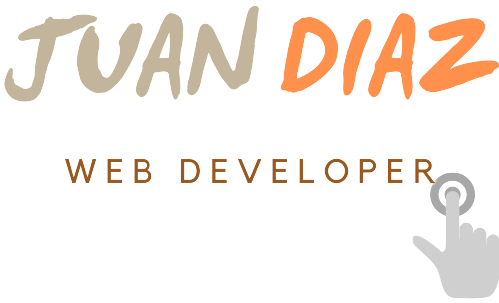
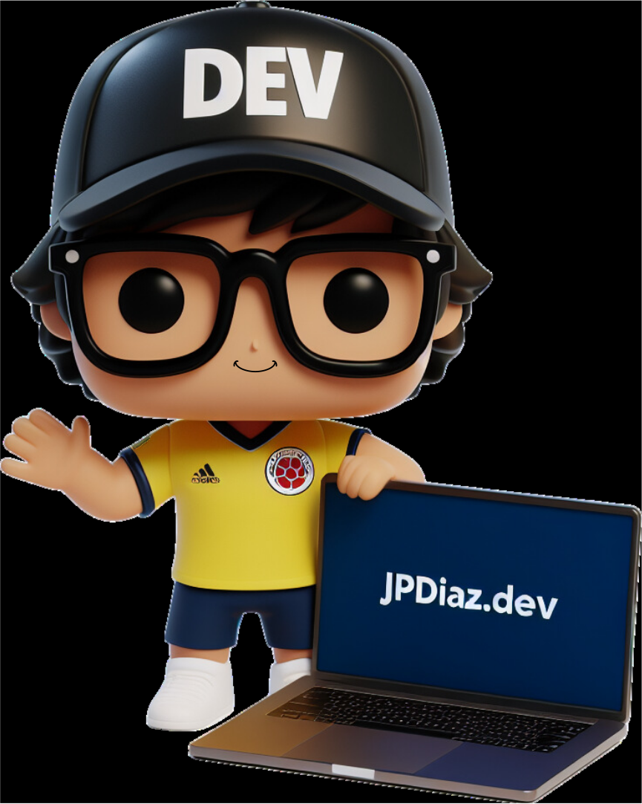

<!-- Editor de README.md
https://www.notion.so/GitHub-Tools-Edit-readme-a55ee707b3914b88b9a92a7a104b3b6c
 -->

<!-- PROJECT LOGO -->

<div align="center">

  <a href="https://github.com/JuanPabloDiaz?tab=repositories">
    
  </a>

<!-- How To Reach Me -->

<div align="center">
  <!--  -->
  <br>
  <a href="https://peerlist.io/1diazdev"></a>
  <a href="https://www.linkedin.com/in/1diazdev/"></a>
  <a href="mailto:juan.diaz.rodriguez93@gmail.com"></a>
  <a href="https://twitter.com/1diazdev"></a>
  <a href="https://dev.to/1diazdev"></a>
</div>

<!-- # Hello 👋 -->

### Hi there  my name is Juan and I am a Front End developer

</div>

<p align="justify">
Passionate Junior Front End Developer: Seeking a startup for growth. Values discipline, loyalty, and reliability. Self-motivated learner, eager to acquire new skills. 💻</p>

<!-- ### 🎯 Some technologies I use: -->

<div align="justify">

[](https://www.w3schools.com/whatis/whatis_html.asp)
[](https://www.w3schools.com/whatis/whatis_css.asp)
[](https://www.w3schools.com/whatis/whatis_js.asp)
[](https://www.w3schools.com/whatis/whatis_react.asp)
[](https://tailwindcss.com/)
[](https://astro.build/)
[](https://git-scm.com/docs)
[](https://www.markdownguide.org/)
[](https://jekyllrb.com/)
[](https://www.github.com/)
[](https://wordpress.org/documentation/)
[](https://www.w3schools.com/php/default.asp)

</div>

<!--
 How to edit the links: >>>> https://home.aveek.io/GitHub-Profile-Badges/

https://www.youtube.com/watch?v=Dl-ekLb4quE
https://simpleicons.org/
https://www.w3schools.com/whatis/whatis_fullstack.asp
-->

<!-- use:   https://home.aveek.io/GitHub-Profile-Badges/ -->

<hr>

 <a href="https://jpdiaz.dev">
    
    <!--  -->
  </a>

  <!-- To generate the avatar >> https://designer.microsoft.com/image-creator?p=Funko+figure+of+%5Ban+activity+or+role%5D%2C+%5Bfemale+or+male%5D%2C+called+%5BName%5D%2C+wearing+a+%5Bspecific+clothes+and+glasses%5D%2C+%5Bspecific+hair%5D+and+has+%5Baccessories%5D.+Holding+a+%5Bsomething%5D.+The+Funko+is+displayed+inside+a+Funko+box+with+%5Btext%5D+text+and+%5Blogo%5D+logo+for+the+box%2C+allowing+visibility+of+the+figure%2C+typography%2C+3D+render -->
  <!-- The Prompt I used to generate the avatar:
   Funko figure of Developer, Male, called Juan Diaz, wearing glasses, Colombia Football Shirt and short, has hat facing forward with the text dev on it. Holding a laptop with the screen facing forward, the screen displays the text jpdiaz.dev. Waving of the hand with the other hand. The Funko is displayed with no background. it has a friendly smile. allowing visibility of the figure, typography, 3D render -->

<!-- ## About Me -->

- 📆 I’m currently working on... My first Full Stack app with next.js
- 🌱 I’m currently learning ... ⚡JS | ⚡React | ⚡Next.js
<!-- - | ⚡Vue | ⚡Solid | ⚡Svelte -->
- 🤔 I’m looking for guidance in... Breaking into the front-end development industry.
- 👯 I’m looking to collaborate on... OSS that I used and understand.
<!-- - 🤔 I’m looking for help with... front end. -->
- 🎮 I'm passionate about... Web Development && Never Stop Learning.
- 💬 Ask me about... My go to framework for Front End.
<!-- - 📫 How to reach me...
  [](https://www.linkedin.com/in/1diazdev/)
  [](https://www.twitter.com/1diazdev)
  [](mailto:juan.diaz93@hotmail.com) -->
- 🎓 My Certifications... [](https://www.freecodecamp.org/1diazdev) [](https://platzi.com/p/1diazdev/)

[](https://git.io/streak-stats)

[](https://github.com/JuanPabloDiaz/github-readme-stats)

<!-- [](https://platzi.com/) -->
  <!--
  icons...            https://gist.github.com/rxaviers/7360908
  Company logos...    https://home.aveek.io/GitHub-Profile-Badges/
  -->

<!-- ### Others 🎭

```javascript
const JuanDiaz = {
  Root: "Bogota" | "Colombia",
  code: [Javascript, HTML, CSS, Python],
  tools: [React, Redux, Node, Storybook, Styled - Components, Jest, Docker],
  architecture: ["microservices", "event-driven", "design system pattern"],
  techCommunities: {
    Web: Platzi.com,
  },
  challenge: "I am doing the #100DaysOfCode challenge focused on Javascript",
};
``` -->

  <!-- Path: "Charlotte" | "NC", -->
