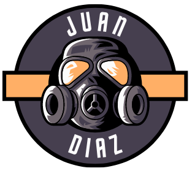

<div id="top"></div>

<!--
[![Contributors][contributors-shield]][contributors-url]
[![Forks][forks-shield]][forks-url]
[![Stargazers][stars-shield]][stars-url]
[![Issues][issues-shield]][issues-url]
[![MIT License][license-shield]][license-url]
[![LinkedIn][linkedin-shield]][linkedin-url]
-->

<!-- Editor de README.md

https://pandao.github.io/editor.md/en.html
https://www.notion.so/GitHub-Tools-Edit-readme-a55ee707b3914b88b9a92a7a104b3b6c

 -->

<!-- PROJECT LOGO -->
<div align="center">
  <a href="https://github.com/JuanPabloDiaz?tab=repositories">
    
  </a>

# Hello 👋

### Hi there  my name is Juan and I am a Front End developer

<p align="justify">
My name is . I am originally from Colombia, but recently moved to Asheville, NC. :us: I have completed an A.A.S in Web Technologies at Central Piedmont Community College in Charlotte, NC. I enjoy developing new skills in both front and back-end development and I am passionate about Full stack Web Development. Currently, I have a few years of experience as a Service Desk Analyst. However, I am looking forward to working with a Startup company that allows for professional and personal growth.  I value discipline, loyalty, reliability, and self-motivation above all else.</p>
</div>

<div>
<!-- My Skills -->
  <h3>Skills</h3>

  <ul>
    <div>✔️ Problem solving skills</div>
    <div>✔️ Critical thinking</div>
    <div>✔️ Time Management</div>
    <div>✔️ Disciplined</div>
    <div>✔️ Detail-oriented</div>
    <div>✔️ Customer Service</div>
    <div>✔️ Adaptability</div>
    <div>✔️ Bilingual</div>
    <div>✔️ Frond End</div>

  </ul>

<br>
<!-- Job Description -->
<!-- <details>
  <summary><b>Current Job Description 💰</b></summary>
  <ul>
    <li>Handles technical troubleshooting within an enterprise environment. Navigates common issues such as user administration, network outages, network printers, IP phones and enterprise tools.</li>
  <li>Provides remote assistance with software deployment, and system configuration.</li>
  <li>Effectively communicate with a variety of departments.</li>
  <li>Proactively investigate and resolve end user problems/complications. </li>
  <li>Adaptability to multiple enterprise environments.Following a process oriented approach. </li>
  <li>Utilizes problem solving skills to find solutions to unusual issues. </li>
  </ul>
</details> -->
</div>

<hr>

## 🎯 Some technologies I use:

<div align="center">

[](https://www.w3schools.com/whatis/whatis_html.asp)
[](https://www.w3schools.com/whatis/whatis_css.asp)
[](https://www.w3schools.com/whatis/whatis_js.asp)
[](https://www.w3schools.com/nodejs/default.asp)
[](https://www.w3schools.com/whatis/whatis_react.asp)
[](https://git-scm.com/docs)
[](https://www.w3schools.com/php/default.asp)
[](https://www.w3schools.com/python/default.asp)
[](https://www.w3schools.com/whatis/whatis_vue.asp)
[](https://www.w3schools.com/whatis/whatis_angularjs.asp)
[](https://www.w3schools.com/whatis/whatis_bootstrap.asp)
[](https://www.w3schools.com/whatis/whatis_json.asp)
[](https://www.w3schools.com/whatis/whatis_json.asp)

</div>
<hr>

## About Me

- 📱 I’m currently working at... jpdiaz.dev
- 🌱 I’m currently learning at... [](https://platzi.com/)

- 📆 I’m currently working on... ⚡HTML5 | ⚡CSS3 | ⚡Javascript | ⚡React
- 👯 I’m looking to collaborate on a... Startup.
- 🤔 I’m looking for help with... Front End.
- 🎮 I'm passionate about... Web Development ⏳︎ NeverStopLearning.
- 💬 Ask me about... Home-Lap & Front-End, HD, Platzi.
- 📫 How to reach me...
  [](https://www.linkedin.com/in/1diazdev/)
  [](https://www.twitter.com/1diazdev)
  [](mailto:juan.diaz93@hotmail.com)
- 🎓 Some of My Certificates... can be found at [](https://platzi.com/p/DiazJuan/)

- 🚲 Hobbies: ... Home-Lab, learn something new on Platzi, cyclist & fitness.

<p align="right">(<a href="#top">👆 Top 👆</a>)</p>

  <!--
  icons...
  https://gist.github.com/rxaviers/7360908
  -->
  <!-- THE PROJECTS -->

## Projects 🚀

### Most Recent Projects 💥💥

#### Home Server 💻

💾 Project [Documentation](https://juanpablodiaz.github.io/SelfHosting-PiServer/)

:link: [Visit my GitHub repository](https://github.com/JuanPabloDiaz/SelfHosting-PiServer) to see all the source code for this project.

<p>
The structure and documentation is saved on an HTML file, the design on a CSS file and the user's interface on a Javascript file. All files are served through <a href="https://www.nginx.com/ " target="_blank " rel="noopener noreferrer ">NGINX</a>, which runs in a wonderful
<a href="https://github.com/linuxserver/docker-letsencrypt " target="_blank " rel="noopener noreferrer ">docker container</a> that is used as a reverse proxy with other
private access services that are also runinng on the Raspberry:
( <a href="https://nextcloud.com/ " target="_blank " rel="noopener noreferrer ">Nextcloud</a>, <a href="https://portainer.com " target="_blank " rel="noopener noreferrer ">Portainer</a>, <a href="https://hub.docker.com/r/b4bz/homer
" target="_blank " rel="noopener noreferrer ">Homer</a>, <a href="https://pi-hole.net/ " target="_blank " rel="noopener noreferrer ">Pi-hole</a>, <a href="https://github.com/linuxserver/docker-qbittorrent " target="_blank " rel="noopener
noreferrer ">qBittorrent</a>, <a href="https://fleet.linuxserver.io/image?name=linuxserver/jackett " target="_blank " rel="noopener noreferrer ">Jackett</a>…).
</p>

<!-- Platzi -->

### Platzi Portfolio 💼

This section list a few projects and new skills that I am developing while studing at Platzi.com

<!-- REPOS THAT I NEED TO FIX -->


[](https://github.com/JuanPabloDiaz/platzi/tree/main/2021)
[](https://github.com/JuanPabloDiaz/platzi/tree/main/2022)

- [2021 Repos:](https://github.com/JuanPabloDiaz/platzi/tree/main/2021) ✔️
  - [Frontend Developer](https://github.com/JuanPabloDiaz/platzi/tree/main/2021/frontendDeveloper) ✔️
  - [Javascript](https://github.com/JuanPabloDiaz/platzi/tree/main/2021/jsBasico) ✔️
  - [Git and Github](https://github.com/JuanPabloDiaz/hyperblog) ✔️
- [2022 Repos:](https://github.com/JuanPabloDiaz/platzi/tree/main/2022) ✔️

  - [Datacademy](https://github.com/JuanPabloDiaz/platzi/tree/main/2022/datacademy) ✔️
  - [HTML & CSS](https://github.com/JuanPabloDiaz/platzi/tree/main/2022/definitivoHTMLyCSS) ✔️

- [2023 Repos:](https://github.com/JuanPabloDiaz/platzi/tree/main/2023) ✔️

<p align="right">(<a href="#top">👆 Top 👆</a>)</p>

### Other Cool Projects


- 2021:
  - [Mr Robot](https://juanpablodiaz.github.io/2021/mrRobot/) (Cool!) ✔️
- 2023:
  - [Matrix - ](https://juanpablodiaz.github.io/2023/matrix/) (Cool!) ✔️
  - [QR code - 2023](https://juanpablodiaz.github.io/2023/text2qr/) (Cool!) ✔️
      <!-- - [](https:///) -->
    <!-- Certificates of challenges -->

Projects in React

- [Portfolio](https://portfolio-react-template-juanpablodiaz.vercel.app/) (Current Project) 🚧
- [Pinterest-clone-react](https://pinterest-clone-react.vercel.app/)
- [Portafolio TEMPLATE](https://portfolio-react-youtube.vercel.app/)
  <!-- - [](https:///) -->

### Platzi Challenges 🎲

This section list some challenges I have participated in Platzi which require time and dedication along other skills.

- [Datacademy 2022](https://deepnote.com/workspace/juandiaz-7746519b-662c-4b7c-b97f-9577567b2970/project/Proyecto-Datacademy-b6457371-4e49-4f83-96ab-1232331cf711/%2FdataProyect%2Ftemplate_proyecto_datacademy.ipynb) (on Deepnote) 📈 | [Certificate ](https://platzi.com/p/DiazJuan/curso/2681-datacademy/diploma/detalle/) | [Gold Certificate ](https://platzi.com/p/DiazJuan/curso/3105-datacademy-proyecto-2022/diploma/detalle/) ✔️

- [Crea tu Primera Página web 2022 (repo)](https://github.com/JuanPabloDiaz/platzi/tree/main/2022/definitivoHTMLyCSS/web2022Challenges) 🌐 | [Certificate ](https://platzi.com/p/DiazJuan/curso/2940-primera-pagina-web-2022-diploma/diploma/detalle/) ✔️

- [Crea tu Portafolio como Web Developer](https://platzi.com/blog/portafolio-web-2022/) 🎬 | [Certificate ](#) (Current Project) 🚧

- Smart Crypto Investments 2022 📀 [Certificate ](https://platzi.com/p/DiazJuan/curso/2787-smart-crypto-investments/diploma/detalle/) ✔️

  <!-- - [](https:///) -->

  <!-- Certificates of challenges -->

### Other Challenges 🎪

This section list other front-end challenges in which I have participated. This are challenges from multiple sites such as [FrontEndMentor](http://frontendmentor.io/), [FrontEndPractice](https://www.frontendpractice.com/), [cssBattle](https://cssbattle.dev/), [CodeWars](https://www.codewars.com/), and others.

- [QR code component - 2022](https://github.com/JuanPabloDiaz/front-endMentor_challenges) 📈
- [Other challenge](#) 🌐

    <!-- SCHOOL PROJECTS -->

### School Portfolio 🏫

This section list some of early projects while I was studing for my A.A.S in Web Technologies at CPCC. 2017-2020

- [Portfolio (2018-20)](https://juanpablodiaz.github.io/) 🚧

<!-- LOS QUE TIENEN EL ✔️ ==> YA LOS REVISE & ESTA DECENTE -->

### Web-Page 🔰🌐

- Since May 2023, [jpdiaz.dev](https://jpdiaz.dev/) is my official website. It is currently under construction 🚧
- My Documentation website is [docs.jpdiaz.dev](https://docs.jpdiaz.dev/)

<!-- ### Others 🎭

```javascript
const JuanDiaz = {
  Root: "Bogota" | "Colombia",
  code: [Javascript, HTML, CSS, Python],
  tools: [React, Redux, Node, Storybook, Styled - Components, Jest, Docker],
  architecture: ["microservices", "event-driven", "design system pattern"],
  techCommunities: {
    Web: Platzi.com,
  },
  challenge: "I am doing the #100DaysOfCode challenge focused on Javascript",
};
``` -->

  <!-- Path: "Charlotte" | "NC", -->

  

<p align="right">(<a href="#top">👆 Top 👆</a>)</p>
