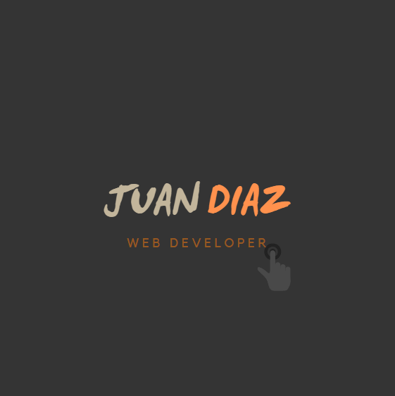

<!--
[![Contributors][contributors-shield]][contributors-url]
[![Forks][forks-shield]][forks-url]
[![Stargazers][stars-shield]][stars-url]
[![Issues][issues-shield]][issues-url]
[![MIT License][license-shield]][license-url]
[![LinkedIn][linkedin-shield]][linkedin-url]
-->

<!-- PROJECT LOGO -->
 

  

  <h2 align="center">Hello</h2>
  

My name is Juan Diaz, I am from Colombia and I recently moved to Asheville, NC.
I am passionate about Full stack Web Development and had completed an A.A.S in Web Technologies at CPCC. I enjoys developing new skills in front-end and back-end development. I have a couple of year of experience as a Service Desk Analyst. I am looking forward to start working with a Startup company that allows for professional and personal growth. I value discipline, loyalty, reliability, and self-motivation above all else.

    <h3>Skills</h3>
    <ul>
        <li>Problem solving skills</li>
        <li>Critical thinking</li>
        <li>Time Management</li>
        <li>Disciplined</li>
        <li>Detail-oriented</li>
        <li>Customer Service</li>
        <li>Adaptability</li>
        <li>Bilingual</li>
    <ul>

    <h3>Current Job Description</h3>
    <ul>
        <li>Handles technical troubleshooting within an enterprise environment. Navigates common issues such as user administration, network outages, network printers, IP phones and enterprise tools.</li>
        <li>Provides remote assistance with software deployment, and system configuration.</li>
        <li>Effectively communicate with a variety of departments.</li>
        <li>Proactively investigate and resolve end user problems/complications. </li>
        <li>Adaptability to multiple enterprise environments.Following a process oriented approach. </li>
        <li>Utilizes problem solving skills to find solutions to unusual issues. </li>
    </ul>

<!-- TABLE OF CONTENTS -->

  
Table of Contents

  <ol>
    <li>
      <a href="#recentProjects">Most Recent Projects</a>
      <ul>
        <li><a href="#home-server">Home Server</a></li>
        <li><a href="#portfolio">Portfolio</a></li>
        <li><a href="#web-page">Web Page</a></li>
      </ul>
    </li>
  </ol>

<!-- ABOUT THE PROJECT -->
## Home Server

[![Product Name Screen Shot][product-screenshot]](https://example.com)

There are many great README templates available on GitHub; however, I didn't find one that really suited my needs so I created this enhanced one. I want to create a README template so amazing that it'll be the last one you ever need -- I think this is it.

Here's why:
* Your time should be focused on creating something amazing. A project that solves a problem and helps others
* You shouldn't be doing the same tasks over and over like creating a README from scratch
* You should implement DRY principles to the rest of your life :smile:

Of course, no one template will serve all projects since your needs may be different. So I'll be adding more in the near future. You may also suggest changes by forking this repo and creating a pull request or opening an issue. Thanks to all the people have contributed to expanding this template!

Use the `BLANK_README.md` to get started.

(<a href="#top">back to top</a>)

### Portfolio

This section should list any major frameworks/libraries used to bootstrap your project. Leave any add-ons/plugins for the acknowledgements section. Here are a few examples.

* [Next.js](https://nextjs.org/)
* [React.js](https://reactjs.org/)
* [Vue.js](https://vuejs.org/)
* [Angular](https://angular.io/)
* [Svelte](https://svelte.dev/)
* [Laravel](https://laravel.com)
* [Bootstrap](https://getbootstrap.com)
* [JQuery](https://jquery.com)

(<a href="#top">back to top</a>)

<!-- GETTING STARTED -->
## Getting Started

dkhaskfhsadkjfhsdlfgyerhfkjnsdvnalvbvbdkhaskfhsadkjfhsdlfgyerhfkjnsdvnalvbvbdkhaskfhsadkjfhsdlfgyerhfkjnsdvnalvbvbdkhaskfhsadkjfhsdlfgyerhfkjnsdvnalvbvbdkhaskfhsadkjfhsdlfgyerhfkjnsdvnalvbvbdkhaskfhsadkjfhsdlfgyerhfkjnsdvnalvbvbdkhaskfhsadkjfhsdlfgyerhfkjnsdvnalvbvbdkhaskfhsadkjfhsdlfgyerhfkjnsdvnalvbvbdkhaskfhsadkjfhsdlfgyerhfkjnsdvnalvbvb

(<a href="#top">back to top</a>)

### Prerequisites

dkhaskfhsadkjfhsdlfgyerhfkjnsdvnalvbvbdkhaskfhsadkjfhsdlfgyerhfkjnsdvnalvbvbdkhaskfhsadkjfhsdlfgyerhfkjnsdvnalvbvbdkhaskfhsadkjfhsdlfgyerhfkjnsdvnalvbvbdkhaskfhsadkjfhsdlfgyerhfkjnsdvnalvbvbdkhaskfhsadkjfhsdlfgyerhfkjnsdvnalvbvbdkhaskfhsadkjfhsdlfgyerhfkjnsdvnalvbvbdkhaskfhsadkjfhsdlfgyerhfkjnsdvnalvbvbdkhaskfhsadkjfhsdlfgyerhfkjnsdvnalvbvb

(<a href="#top">back to top</a>)

### Installation

(<a href="#top">back to top</a>)

